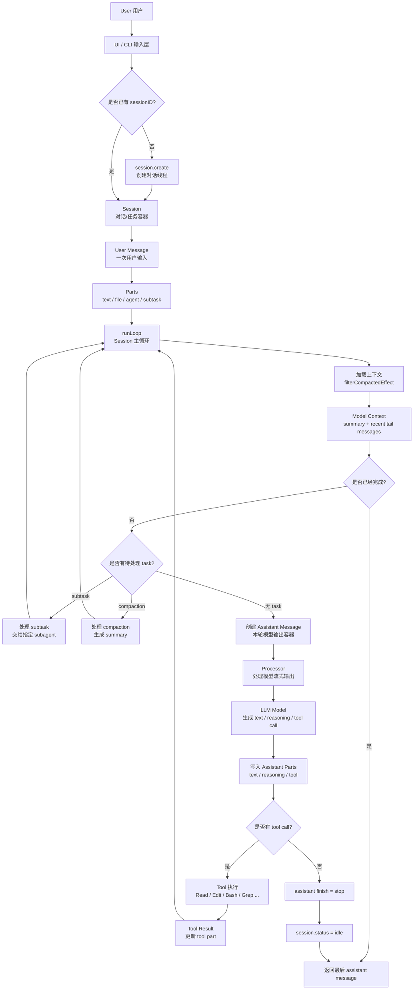

# OpenCode 项目调试理解记录

这个文档用于记录调试 OpenCode 过程中逐步形成的项目理解，包括核心概念、关键调用链、状态变化、入口文件和容易混淆的实现细节。

## Session 与 Prompt 流程

`session` 不是每一轮新的对话消息，而是一整个对话线程或任务线程。用户新开一个对话时，会先创建一个 `session`；之后继续输入 prompt，都是往同一个 `sessionID` 下追加新的 message 和 part。

结构可以简化理解为：

```text
session
  -> user message
     -> text/file/agent/subtask parts
  -> assistant message
     -> text/tool/reasoning parts
  -> user message
  -> assistant message
```

新对话第一次发送 prompt 时，流程不是直接向不存在的 session 写入内容，而是：

```text
用户发送第一次 prompt
  -> 前端或 CLI 先调用 session.create(...)
  -> 后端创建 session 并返回 sessionID
  -> 再调用 session.prompt({ sessionID, ... })
  -> prompt 逻辑向该 session 追加 user message
  -> assistant loop 开始回复
```

`SessionPrompt.prompt` 的核心职责是“向已有 session 追加一次用户输入，并按需触发 assistant 回复”。它会：

- 通过 `sessions.get(input.sessionID)` 获取已有 session。
- 清理可能残留的 revert 状态。
- 创建 user message 和对应 parts。
- 更新 `session.time.updated`。
- 按需更新 session permission。
- 如果 `noReply` 为 true，只保存用户消息。
- 否则进入 `loop({ sessionID })`，驱动 assistant 回复、工具调用、压缩或子任务。

运行状态大致是：

```text
idle -> busy -> retry? -> busy -> idle
```

其中 `SessionRunState.ensureRunning(...)` 保证同一个 session 同时只有一个主运行流程。

## 用户、Session、Message、Part 与模型循环

OpenCode 中用户和大模型交互的核心抽象可以理解为：

```text
session = 一整条对话/任务线程的状态容器
message = user 或 assistant 的一次交互记录
part = message 内部的结构化片段
runLoop = 推进 session 的主状态机
processor = 处理一次模型流式输出的执行器
tool/subtask/compaction = loop 中可能触发继续运行的任务类型
```

层级关系是：

```text
Session
  -> Message
     -> Part
```

执行关系是：

```text
runLoop 负责推进整个 session
Processor 负责处理一次模型输出流
Model/Tool 提供外部能力
```



这个设计的好处是把一次 AI 编程任务拆成可持久化、可恢复、可观察的结构化状态：

- `session` 让用户可以继续、恢复、fork 或查看一整条任务线程。
- `message` 记录每一次 user 输入和 assistant step。
- `part` 让文本、文件、工具调用、reasoning、压缩、子任务都能被分别存储和渲染。
- `runLoop` 让一次 prompt 可以经过多轮模型调用和工具调用，而不是停留在单次问答。
- `processor` 让模型流式输出可以实时写回 session，UI 能同步展示生成中、工具运行中、完成或失败状态。

对用户体验的提升主要体现在：

- 用户能实时看到模型正在输出、调用工具或等待权限。
- 长任务可以通过多轮 loop 自动推进，不需要用户手动拆成很多次提问。
- 历史过长时可以自动 compaction，保留摘要和最近上下文，降低上下文爆掉的概率。
- 工具调用是结构化的，UI 可以清楚展示工具名称、参数、运行状态和结果。
- session 持久化后，任务可以恢复，也方便调试和回放。

## Subtask 的意义

`subtask` 是 `part.type` 的一种，定义在 `SessionLegacy.SubtaskPart` 中。它不是普通文本，也不是 assistant 自己最终回答的一部分，而是“把一段任务交给指定 agent/subagent 执行”的结构化任务描述。

一个 `subtask part` 大致包含：

```text
type: "subtask"
prompt: 子任务具体要求
description: 子任务描述
agent: 由哪个 agent/subagent 处理
model: 可选，子任务指定模型
command: 可选，来源命令
```

`runLoop` 中会优先处理 `subtask`：

```text
发现未处理 subtask
  -> handleSubtask(...)
  -> 创建 assistant message
  -> 创建 Task tool part
  -> 调用 Task tool / subagent
  -> 把结果写回当前 session
  -> continue 回到 runLoop，重新读取上下文
```

它的意义是把复杂任务从主对话中拆出去，让专门的 agent 处理，然后把结果作为工具结果回写到当前 session。

和普通 tool 的区别：

```text
普通 tool:
  用来执行具体动作，例如 Read/Edit/Bash/Grep。

subtask:
  用来委派一段更高层的任务，例如“让某个 agent 分析这个问题并返回结论”。
```

这样做的好处：

- 主 agent 不需要把所有细节都塞在一个上下文里处理，可以委派给更合适的 subagent。
- 子任务有独立的 prompt、agent、model 配置，适合专业化处理。
- 结果仍然回写到当前 session，主 loop 可以继续基于结果推进。
- UI 上可以把它展示成一个明确的任务执行过程，而不是一段不可解释的文本。

可以把 `subtask` 理解成：

```text
在当前 session 中创建一个“任务委派点”，
由指定 subagent 完成局部工作，
再把结果作为结构化工具输出交还给主 session。
```

## Coding Agent 的实现难点与体验关键点

这一类 coding agent 的难点不在于调用一次 LLM，而在于把 LLM 封装成一个可持续执行、可恢复、可观察、可控风险的任务系统。

核心挑战是将不稳定的模型输出放进稳定的状态模型中：

```text
session -> message -> part -> runLoop -> processor -> tool/model
```

### 主要实现难点

1. 状态建模

不能把所有内容都当成一段字符串保存。需要用 `session/message/part` 表达对话、工具调用、reasoning、文件引用、压缩和子任务。

这样 UI 才能知道 agent 当前是在输出文本、调用工具、等待权限、执行失败，还是已经完成。

2. Loop 控制

coding agent 是多步任务系统，不是单轮问答。一次 prompt 可能经历：

```text
模型输出
  -> 工具调用
  -> 工具结果写回
  -> 重新构造上下文
  -> 再次调用模型
  -> 压缩或子任务
  -> 最终回答
```

这里最难的是判断什么时候继续、什么时候停止，以及如何处理中断、失败、重试、上下文溢出和重复工具调用。

3. 上下文构造

真正发给模型的不是数据库原始消息，而是经过组织后的上下文：

```text
system prompt
+ environment
+ instructions
+ skills
+ filtered/compacted messages
+ recent tail
+ tool results
```

上下文构造需要在“保留足够信息”和“避免上下文爆掉”之间做平衡。compaction 的质量会直接影响长任务体验。

4. 工具调用安全

agent 的能力来自工具，风险也来自工具。工具调用需要权限控制、参数展示、执行状态、输出截断、错误恢复和取消处理。

用户不能只看到一个黑盒 loading，而应该知道 agent 准备做什么、做到了哪一步、失败在哪里。

5. 流式 UI 同步

好的体验不是等很久后给出一段答案，而是持续反馈：

```text
正在思考
正在读文件
正在搜索
正在编辑
正在运行命令
等待权限确认
完成或失败
```

这要求后端将 message/part 的增量变化实时同步给 UI，UI 再按 part 类型展示不同状态。

6. Subtask 与多 agent 协作

`subtask` 让主 agent 可以把局部任务委派给指定 subagent。难点在于控制子任务拿到什么上下文、如何返回结果、是否继承权限，以及失败后如何回到主 loop。

做得好时，用户会感觉是一个主工程师在协调多个专门助手，而不是单个模型硬撑整个复杂任务。

### 需要重点做好的能力

- 可观察性：用户始终知道 agent 当前在做什么。
- 可恢复性：session、message、part 持久化后，刷新或重启仍能继续。
- 上下文质量：compaction 要保留用户意图、已完成操作、失败尝试和当前 TODO。
- 工具结果表达：工具输出需要结构化、可折叠、可定位，避免淹没主回答。
- 中断和失败处理：取消或失败后，message/part 状态不能悬空，session 不能卡死。
- 权限体验：权限请求要说明工具、参数和原因，避免用户盲目 allow。
- 多步任务收敛：需要 max steps、doom loop 检测和清晰的最终总结。

### 对用户体验的提升

这些抽象和控制逻辑最终服务于用户体验：

- 用户能看到 agent 的执行过程，而不是等待一个不可解释的结果。
- 长任务可以自动拆成多轮模型调用和工具调用，不需要用户手动分解。
- 工具调用和权限请求透明，用户更容易建立信任。
- 上下文过长时可以自动压缩，减少长会话失败。
- 任务失败、中断或重试时仍然有明确状态，用户可以继续推进。

一句话总结：

```text
好的 coding agent 不是简单包装 LLM，
而是把 LLM 输出放进稳定的 session/message/part 状态机，
再用清晰的 UI 展示每一步执行过程。
```

## 可迁移的工程实现细节

下面记录目前调试过程中确认过、可以迁移到自己项目中的工程设计细节。

### 1. 数据模型要先稳定

推荐最小抽象：

```text
Session
  id
  title
  status
  permissions
  created_at
  updated_at

Message
  id
  session_id
  role: user | assistant
  parent_id?
  agent
  model
  finish?
  error?
  tokens?
  cost?
  created_at
  completed_at?

Part
  id
  session_id
  message_id
  type
  payload/state
  created_at
  updated_at?
```

关键点：

- `session` 是任务线程，不是单轮消息。
- `message` 是一次 user 输入或一次 assistant step。
- `part` 是 message 内部的结构化片段。
- 工具、reasoning、文件、压缩、子任务都应该作为 `part.type`，不要塞进一段纯文本。

一个用户 prompt 可能产生：

```text
1 user message
N assistant messages
M tool parts
```

### 2. 用户输入封装流程

用户第一次输入时不要直接调用模型，而是先确保 session 存在：

```text
没有 sessionID
  -> create session
  -> 得到 sessionID
  -> prompt(sessionID, input)

已有 sessionID
  -> prompt(sessionID, input)
```

`prompt` 内部应该只做“向已有 session 追加输入”：

```text
get session
cleanup revert/dirty state
create user message
resolve input parts
touch session.updated_at
update permissions if needed
if noReply return user message
else runLoop(sessionID)
```

用户输入不要只保存 raw text，而要拆成 parts：

```text
text part
file part
agent part
subtask part
```

这样后续模型上下文、UI 渲染、工具权限都能基于结构化数据工作。

### 3. Agent 主循环应该是状态机

主循环不应该假设“一次 prompt = 一次 LLM 调用”。更合理的是：

```text
while true:
  set session status busy
  load model context from session
  derive latest user / assistant / finished / tasks
  if latest assistant is finished and no pending tool:
    break
  if has subtask:
    process subtask
    continue
  if has compaction:
    process compaction
    continue
  if context overflow:
    create compaction task
    continue
  create assistant message
  resolve tools and permissions
  build system prompt and model messages
  process LLM stream
  if model requested tool or compaction:
    continue
  break
set session status idle
return last assistant message
```

重要经验：

- 每一轮都从存储重新读取 session 上下文，不要只依赖内存。
- 结束条件要看 `finish` 和 pending tool，不要只看是否生成了文本。
- 同一个 session 同时只允许一个主 loop，避免并发写坏消息流。
- 多个 session 可以并行，每个 session 独立维护运行状态。

### 4. 模型上下文不是数据库原始历史

真正发给模型的内容应该经过重组：

```text
DB messages
  -> filter compacted history
  -> keep summary + recent tail
  -> apply reminders / injected instructions
  -> plugin or hook transform
  -> convert message/part to provider messages
  -> append system prompt
```

压缩后的数据库可以同时保留：

```text
旧原始消息
compaction user message
summary assistant message
最近未压缩 tail messages
当前 user message
```

但模型上下文中只放：

```text
summary
recent tail
current user
tool results needed for continuation
```

这样可以保留可回放历史，同时控制 LLM 上下文长度。

### 5. LLM 输出要由 Processor 解释

不要让模型输出直接修改业务状态。应有一个 `processor` 负责解释模型 stream event：

```text
reasoning-start
  -> create reasoning part

reasoning-delta
  -> append reasoning text delta

text-start
  -> create text part

text-delta
  -> append text delta

tool-call
  -> create/update tool part running

tool-result
  -> update tool part completed/error

step-finish
  -> update assistant finish/tokens/cost
  -> create step-finish part

error/abort
  -> mark assistant error/completed
```

这层的价值：

- UI 可以流式展示。
- 工具状态可观察。
- 中断后不会留下悬空 assistant message。
- 模型输出格式变化时，只需要集中改 processor。

### 6. Tool 结果如何回给模型

在内部存储里，工具结果不一定要建成独立 `role: tool` 的 message。可以保存为：

```text
assistant message
  -> tool part
     tool name
     call id
     input
     state: pending | running | completed | error
     output
```

下一轮构造模型上下文时，再把 `tool part` 转成 provider 需要的 tool result 格式：

```text
internal tool part
  -> model message part: tool-<name>
  -> output-available / output-error
  -> toolCallId
  -> input
  -> output
```

这样内部状态模型保持统一，外部 provider 格式变化也不会污染核心数据结构。

### 7. 权限和工具解析要独立成层

工具不应该直接暴露给模型。每轮调用模型前，应该根据以下信息生成可用工具集合：

```text
agent config
session permission
model capability
MCP/tools registry
plugin hooks
current messages
```

执行工具前要能询问权限，并且权限请求要包含：

```text
tool name
input args
session id
reason or metadata
allow/deny/always options
```

这样用户能理解 agent 为什么需要执行某个动作。

### 8. Subtask 的工程位置

`subtask` 适合实现为一种 `user message part`，而不是独立 API 分支。

主 loop 发现未处理 `subtask part` 后：

```text
create assistant message
create Task tool part
run subagent/task tool
write result to tool part
optional: create synthetic user message asking main agent to summarize/continue
continue main loop
```

这样 subtask 既能复用 tool UI，又能让主 session 继续推进。

### 9. UI 体验依赖事件粒度

后端应该对这些状态变化发事件或可订阅更新：

```text
session.created
session.updated
session.status
message.updated
part.updated
part.delta
permission.requested
tool.running
tool.completed
tool.error
```

UI 不应该只等最终结果，而应该基于 part 状态展示：

```text
text streaming
reasoning collapsible
tool running/completed/error
permission blocking
retry countdown
compaction in progress
```

这能把“等待模型”变成“观察任务推进”。

### 10. 调试时最有价值的观察点

调试这类系统时，最有价值的断点或日志点是：

```text
prompt input
create user message
resolved user parts
filtered/compacted msgs
converted model messages
created assistant message
resolved tools
LLM stream input
stream event handler
tool-call
tool-result
step-finish
updatePart unified exit
```

重点观察变量：

```text
input.parts
message.info
message.parts
msgs
lastUser
lastAssistant
tasks
tools
modelMsgs
streamInput
value.type
assistantMessage
currentText
reasoningMap
toolcalls
part
```

### 11. 项目实现时的优先级

如果在自己的项目中落地，建议按这个顺序实现：

```text
1. session/message/part 持久化模型
2. prompt -> user message/parts 封装
3. runLoop 单 session 串行运行
4. processor 处理 text stream
5. tool part 状态机
6. tool result 回灌模型上下文
7. session status + UI 实时同步
8. compaction
9. subtask/subagent
10. permission、retry、doom loop、abort 完善
```

不要一开始就追求多 agent。先把单 session、单 loop、tool call 回灌模型这条链路做稳。
